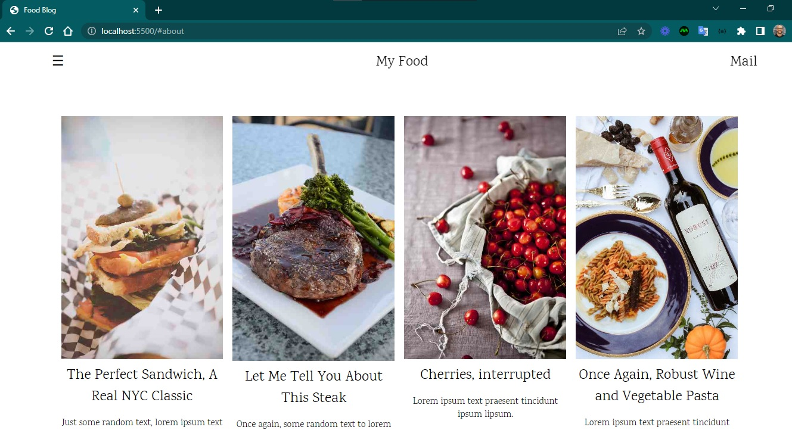
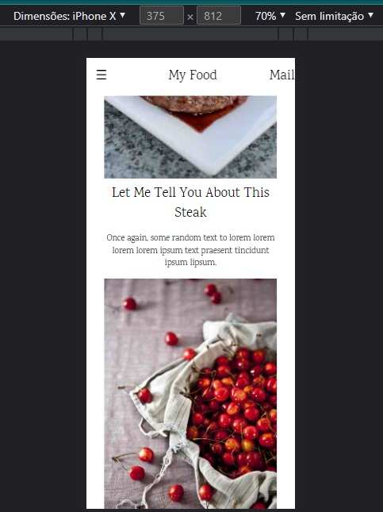

<h4 align="center"> 
	🚧 Food 🚀
</h4>

<h1 align="center">
    
</h1>

- Projeto de um site institucional de um restaurante.

#### Requisitos

- [ ] design personalizado
- [ ] responsividade
- [ ] favicon

#### Telas

- Desktop

    

- Mobile

    

#### Inspirações para aperfeiçoamentos  

- [Clube de café](https://www.graogourmet.com/)
- [História de café](https://www.clubecafe.net.br/historia-cafe)
- [Origem do café](https://www.mokaclube.com.br/blog/origem-do-cafe/)
- [Poemas de café](https://www.mokaclube.com.br/blog/poemas-com-cafe/)
- [Cafeterias em SP](https://tudosobrecafe.com/melhores-cafeterias-de-sao-paulo)
- [Guia do café](https://simonde.com.br/o-guia-definitivo-dos-melhores-cafes-de-sao-paulo-sp/)
- [Baristas](https://revistamenu.com.br/os-melhores-baristas-do-mundo-em-disputa-no-brasil/)

